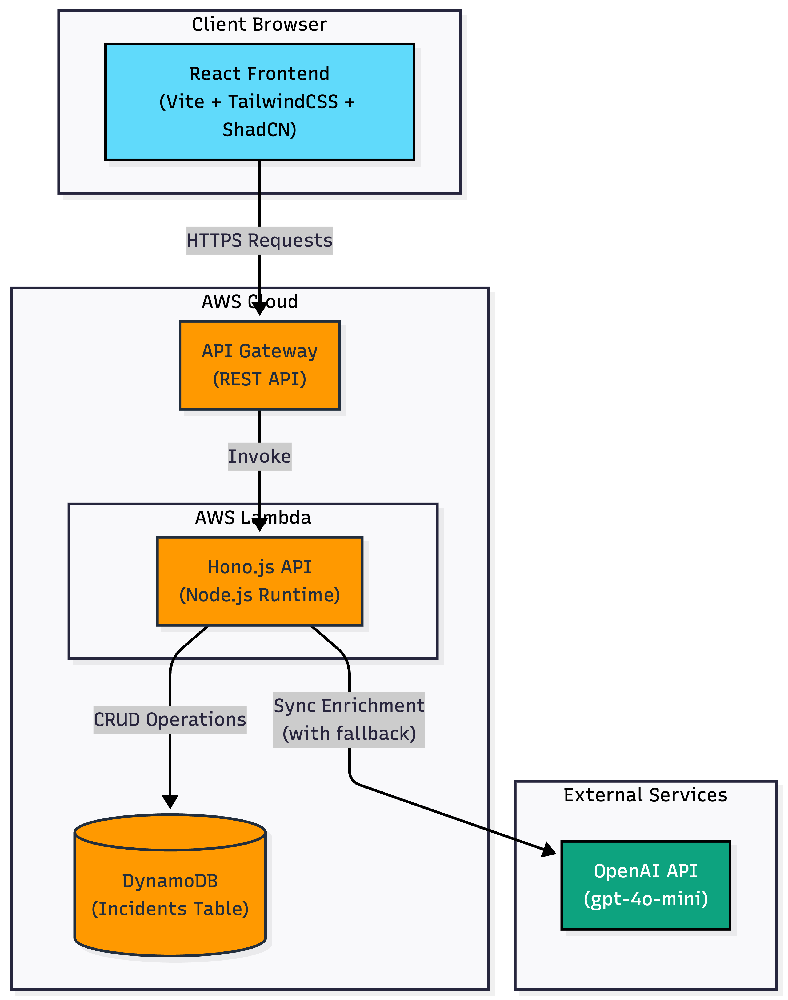
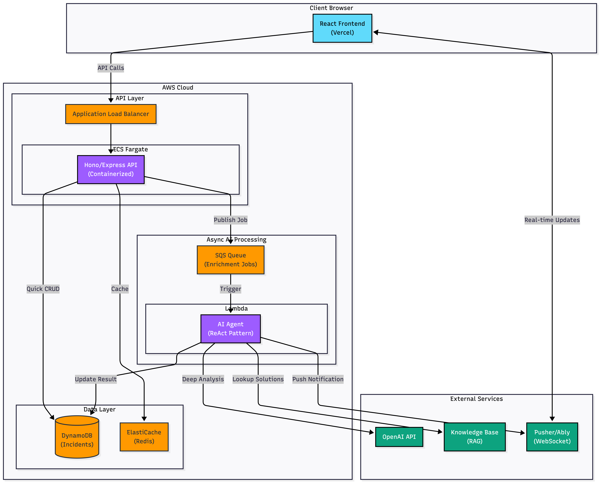

# ERP Incident Triage Portal

AI-powered incident management for Oracle ERP systems. Submit an incident, get automatic severity classification and suggested actions.

---

## Quick Start

**Watch the demo**: [Loom Video](https://www.loom.com/share/47f20d6d4bea41118715275b26423690)

**Try it live**: [https://erp-incident-triage-portal-ll58.vercel.app](https://erp-incident-triage-portal-ll58.vercel.app)  
No login required. Just submit an incident and see AI enrichment in action.

---

## Architecture

### Implemented




----

### With More Time



---

## Running Locally

### Prerequisites

- Node.js 18+
- npm
- Docker (for local DynamoDB)
- OpenAI API key (optional—fallback works without it)

### Backend

```bash
cd backend
npm install
cp .env.example .env    # Add OPENAI_API_KEY if you have one
docker-compose up -d    # Start local DynamoDB
npm run db:setup        # Create table (first time only)
npm run dev             # Runs at http://localhost:3001
```

### Frontend

```bash
cd frontend
npm install
npm run dev             # Runs at http://localhost:5173
```

### Deploy to AWS

```bash
cd backend
npm run deploy          # Uses SST to deploy Lambda + API Gateway + DynamoDB
```

---

## Tech Stack & Rationale

### Backend

**Lambda + API Gateway** — Chose serverless for the easiest path to production. Free tier covers 1M requests/month. Yes, there's cold start latency (~500ms), but acceptable for this use case and avoids managing infrastructure.

**Hono.js** — Built specifically for serverless/edge. 14KB bundle vs Express's 200KB+ means faster cold starts. TypeScript-first with great DX.

**SST (Serverless Stack)** — TypeScript infrastructure-as-code. Wanted the entire stack in one language. 

**DynamoDB** — NoSQL fits well here—incident schema may evolve with business needs. Generous free tier (25GB), serverless, and DynamoDB Local means identical behavior in dev.

**OpenAI (gpt-4o-mini)** — Fast, cheap ($0.15/1M tokens), good enough for classification. Falls back to rule-based heuristics if API is unavailable.

### Frontend

**React + Vite** — React because it's what I know best. Vite for fast dev server and builds.

**Tailwind + ShadCN** — Ship fast with good defaults. ShadCN gives accessible, customizable components without the bloat of a full UI library.

**TanStack Query** — Handles caching, background refetch, pagination. No more manual loading states everywhere.

---

## Design Decisions

### Why Synchronous AI Enrichment?

I intentionally kept enrichment synchronous (user waits ~2s for OpenAI response) instead of async (SQS → Lambda).

**Reasons:**
- Simpler to test locally—no queue infrastructure needed
- User sees complete result immediately
- For MVP traffic, latency is acceptable

The code is structured to easily swap to async when needed. See [Future Improvements](#future-improvements) .

### Why DynamoDB over PostgreSQL?

- Incident schema will likely evolve—NoSQL handles this gracefully
- Serverless (no connection pooling headaches with Lambda)
- Free tier is generous for MVP

---

## Assumptions

Made these calls to keep scope reasonable:

| Decision | Why |
|----------|-----|
| **No authentication** | Assignment said optional. Would add auth in production. |
| **No async processing** | Keeps local dev simple. Evaluators can test full flow without SQS. |
| **No caching** | DynamoDB is fast enough at this scale. |
| **No rate limiting** | Would add API Gateway throttling in production. |
| **Predefined business units** | Hardcoded list. Production would make this configurable. |

### Severity Definitions

| Level | Meaning |
|-------|---------|
| **P1** | Production down, immediate action needed |
| **P2** | Major impact, needs attention within hours |
| **P3** | Minor issue, can be scheduled |

---

## Future Improvements

With more time, I'd build the architecture shown in the second diagram:

### Async AI Processing

**Current**: User waits for OpenAI response.

**Future**: 
1. API returns immediately with `status: "analyzing"`
2. SQS queues the enrichment job
3. Lambda runs AI Agent (ReAct pattern) that can:
   - Search knowledge base for similar incidents
   - Make multiple LLM calls for deeper analysis
   - Correlate with historical data
4. Pusher/Ably sends real-time update when done

This decouples submission from analysis—better UX and handles OpenAI rate limits gracefully.

### Other Production Needs

- **ECS Fargate for API** — If cold starts become a problem, move to containers with ALB
- **ElastiCache (Redis)** — Cache frequent queries
- **Rate limiting** — API Gateway throttling to prevent abuse
- **Authentication** — Role-based access for different teams
